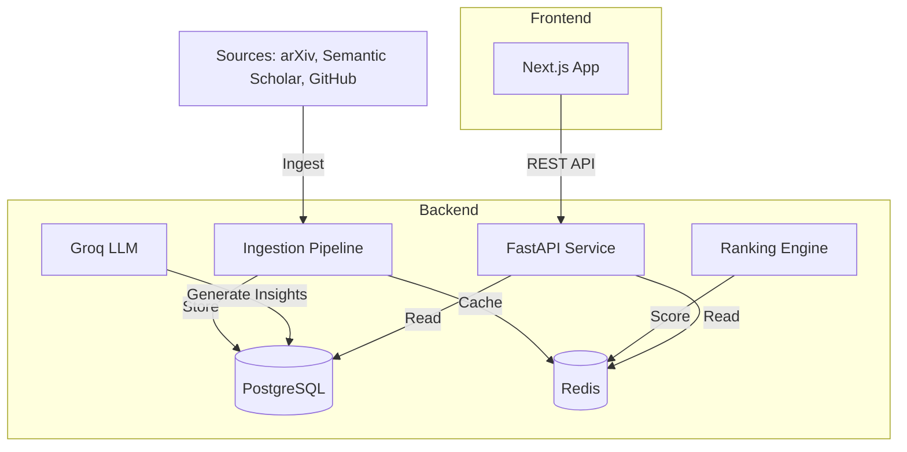

# Paper Radar

**Academic paper discovery platform** that aggregates, ranks, and provides deep insights for research papers. Built for researchers who want to cut through the noise.


## Architecture



## Key Features

- **Smart Ranking V2**: Papers are ranked by a weighted score of meaningful signals, not just citation counts.
    - **Freshness Boost**: New papers (<7 days) get a 3.0x score multiplier.
    - **Velocity**: We track daily citation rates to find rising stars.
    - **Code Availability**: Papers with implementation code are prioritized.
- **Deep Dive Insights**: AI-generated structured summaries that explain papers without needing to open the PDF.
    - **ELI5**: "Explain Like I'm 5" simplifications.
    - **Methodology & Use Cases**: Technical deep dives extracted automatically.
- **Implementation Finder**: Automatically links GitHub repositories and HuggingFace models to papers.

## Quick Start

### Prerequisites
- Python 3.11+ & [uv](https://github.com/astral-sh/uv)
- Node.js 18+
- Docker & Docker Compose (optional for local development)

### Local Development (No Docker Required!) ⭐

For quick local development without Docker, the app uses SQLite and file-based caching. Your data persists in the `backend/data/` folder.

```bash
# 1. Clone & Setup
git clone https://github.com/Adarshh9/paper-radar.git
cd paper-radar

# 2. Configure Environment
cp backend/.env.local.example backend/.env
# Edit backend/.env: Add GROQ_API_KEY (for AI summaries) and GITHUB_TOKEN (for implementations)

# 3. Setup Backend
cd backend
uv sync

# 4. Quick Start (initializes DB and runs ingestion)
uv run python -m scripts.quickstart

# 5. Start Backend API
uv run uvicorn app.main:app --reload

# 6. Start Frontend (in another terminal)
cd frontend
npm install && npm run dev
```

Visit **http://localhost:3000** to browse.

### Docker Setup (Production-like)

```bash
# 1. Clone & Setup Utils
git clone https://github.com/Adarshh9/paper-radar.git
cd paper-radar

# 2. Configure Environment
cp backend/.env.example backend/.env
# Edit backend/.env: Add GROQ_API_KEY (required) and GITHUB_TOKEN (optional)
# Set USE_LOCAL_STORAGE=false in .env

# 3. Start Infrastructure (DB + Redis + API)
docker-compose up -d

# 4. Start Frontend
cd frontend
npm install && npm run dev
```

## Backend Workflow

The backend is organized into modular services and data pipelines.

### Data Pipelines

**Unified Pipeline** (Recommended):
```bash
# Run all stages in sequence (quick mode for faster initial setup)
uv run python -m scripts.run_pipeline --quick

# Full pipeline with all papers
uv run python -m scripts.run_pipeline

# Skip enrichment if hitting rate limits
uv run python -m scripts.run_pipeline --skip-enrichment
```

**Individual Scripts**:

1.  **Ingestion**: Fetches latest papers from arXiv (CS.AI, CS.LG, etc.).
    ```bash
    uv run python -m scripts.ingest_arxiv_daily
    ```
2.  **Enrichment**: Adds citation counts from Semantic Scholar and code links from GitHub.
    ```bash
    uv run python -m scripts.enrich_semantic_scholar
    uv run python -m scripts.discover_implementations
    ```
3.  **Insight Generation**: Uses Groq (Llama 3) to generate ELI5/Methodology summaries.
    ```bash
    uv run python -m scripts.generate_summaries
    ```
4.  **Ranking**: Calculates scores and caches trending lists.
    ```bash
    uv run python -m scripts.calculate_ranking_scores
    ```

## Configuration

### Backend variables (`backend/.env`)
| Variable | Descrption |
|----------|-------------|
| `DATABASE_URL` | PostgreSQL connection string |
| `REDIS_URL` | Redis connection string |
| `GROQ_API_KEY` | **Required** for AI summaries |
| `GITHUB_TOKEN` | Recommended to avoid rate limits |
| `Paper Radar Secret` | JWT signing key |

### Frontend variables (`frontend/.env.local`)
| Variable | Default | Description |
|----------|---------|-------------|
| `NEXT_PUBLIC_API_URL` | `http://localhost:8000/api` | Backend API URL |

## Contributing
1. Fork the repo
2. Create feature branch (`git checkout -b feature/amazing-feature`)
3. Commit changes (`git commit -m 'Add amazing feature'`)
4. Push to branch (`git push origin feature/amazing-feature`)
5. Open a Pull Request

## License
MIT License. See [LICENSE](LICENSE).
